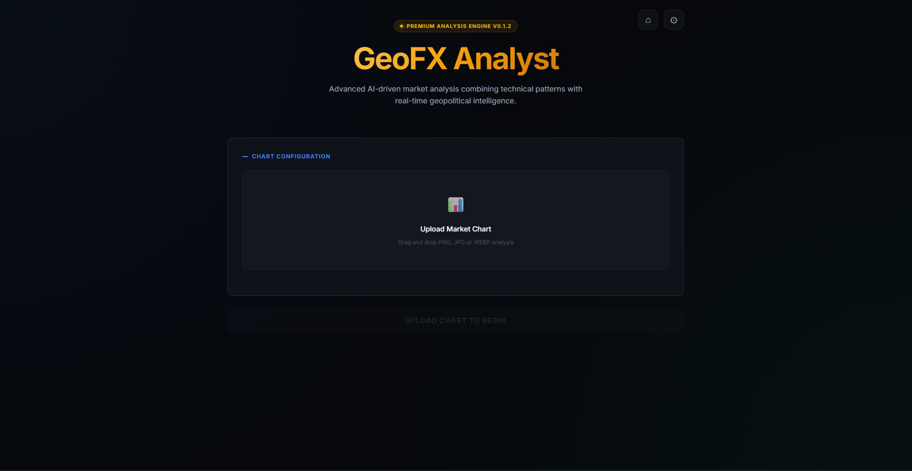

# GeoFX Analyst v0.1.3 🚀

**Advanced AI-driven Market Analysis Terminal**



GeoFX Analyst is a high-performance, premium dashboard designed for forex traders and market analysts. It combines state-of-the-art visual intelligence (Gemini 3.1) with real-time geopolitical grounding to provide professional-grade trading insights.

## ✨ Key Features

- **Multi-Timeframe Synthesis**: Upload up to 3 charts (e.g. H4, H1, M15) for AI-driven Top-Down Analysis.
- **Deep Chart Vision**: Automated instrument detection using Chain-of-Thought OCR logic.
* **Intelligence Engine**: Powered by the latest Gemini 3.1 & 2.5 families (April 2026 specs).
* **Geopolitical Grounding**: Real-time analysis of news affecting specific currency pairs.
* **Premium Aesthetic**: Sophisticated dark-mode dashboard with golden accents and glassmorphism.
* **Security Focused**: Implements Content Security Policy (CSP) and local-first data persistence.

## 🛠 Tech Stack

- **Core**: React 19 + Vite 8
- **AI Integration**: Google Gemini API (v1beta)
- **Styling**: Modern CSS with CSS Variables & Glassmorphism
- **Deployment**: Automated release workflow for optimized builds.

## 🚀 Local Setup & Development

Follow these steps to get the terminal running on your local machine:

### 1. Prerequisites
Ensure you have **Node.js (v18+)** and **npm** installed on your system.

### 2. Installation
Clone the repository and install the dependencies:
```bash
git clone https://github.com/Vondereich/VonFXAnalyzer.git
cd VonFXAnalyzer
npm install
```

### 3. Development
Start the local development server:
```bash
npm run dev
```
Once started, open [http://localhost:5173](http://localhost:5173) in your browser.

### 4. Production Build
To generate an optimized production bundle:
```bash
npm run build
```
The output will be available in the `dist/` directory.

### 5. Automated Release
To clean, build, and package the application into a ZIP file:
```bash
npm run release
```
This generates `VonAnalyzer.zip` in the root directory.

## 🌐 Traditional Hosting (XAMPP / Laragon / WAMP)

If you prefer to host this terminal using a traditional web server (Apache/Nginx) or local environments like XAMPP, Laragon, or WAMP:

1.  **Build the Project**: Run `npm run build`.
2.  **Locate the Build**: Go to the `dist/` folder.
3.  **Deployment**: Copy **all files inside** the `dist/` folder and paste them into your server's public directory:
    *   **XAMPP**: `C:\xampp\htdocs\vonalanalyzer\`
    *   **Laragon**: `C:\laragon\www\vonalanalyzer\`
    *   **WAMP**: `C:\wamp64\www\vonalanalyzer\`
4.  **PHP Proxy (Optional)**: If your hosting environment supports PHP and you face CORS issues, you can use the included `proxy.php`. Simply point your **Proxy URL** in the app settings to `http://localhost/vonalanalyzer/proxy.php`.
5.  **Access**: Open your browser and go to `http://localhost/vonalanalyzer/`.

## ⚙️ Configuration

Open the **Terminal Settings** (⚙) within the app to:

- Provide your **Gemini API Key**.
- Set an optional **Proxy Endpoint** (for shared hosting compatibility).
- Select your preferred **Intelligence Engine** (Gemini 3.1 Flash/Pro).

## 🔒 Security

This application is designed to be client-side only. Your API keys are stored in your browser's local storage and are never sent to any server other than the Google AI API (or your configured proxy).

---

_Created with ❤️ for professional traders._
